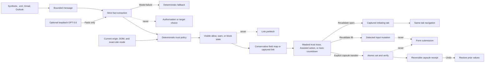

# ContextFill

[](https://github.com/lzongren/contextfill/actions/workflows/ci.yml)

> **ContextFill turns the right message into a temporary, origin-bound context capsule—then transfers only the facts the current page needs.**

ContextFill is a privacy-first Chrome extension whose hero flow is **Verified Context Capsules**. For airline check-in, it extracts exactly a booking reference and passenger surname from one recent message, proves why that message belongs to the requesting origin, maps each fact to one visible safe field, and performs one reversible two-field transfer only after explicit approval. The compact trust trace keeps the chain visible: **Message → trust checks → capsule → destination**.

The same deterministic message-to-page engine supports **Verified Auto-Continue** for OTPs and magic-login/email-confirmation links. Every new site starts Manual. Assisted and Auto-Continue require an inspectable, revocable exact-origin grant; Auto adds a visible cancellable countdown and a separate acknowledgement that a destination page may react to the last OTP digit. ContextFill never prefollows a link, touches the clipboard, clicks Submit/Login, calls a form-submission API, or lets a model authorize an action. A narrow manual **Trusted Reference Transfer** remains supported.

This is a judge-testable hackathon prototype, not a production security product.

## The problem

“Check your email” interrupts sign-in, confirmation, booking, and support flows. Users must locate the right message, distinguish the real action from lookalikes, and carry one or more temporary facts back to the correct page. Existing OTP autofill handles one narrow shape but does not provide a transparent, general message-to-page trust decision.

ContextFill demonstrates a different interaction model. Detection, extraction, authorization, and execution are separate:

- An extractor identifies bounded temporary facts in one recent message.
- Deterministic code checks the page hostname, registrable domain, sender evidence, claimed service, recency, expiry, replay state, and controlled lookalike signals.
- An in-page status card makes waiting, matching, verification, countdown, success, and block states visible.
- The user chooses Manual, Assisted, or Auto-Continue per exact site; the model never chooses a mode or authorizes an action.
- Immediately before execution, ContextFill rechecks the exact tab URL, page hostname and intent, site permission/mode, candidate freshness/replay, and deterministic allow decision.
- A conservative mapper identifies only unambiguous, visible, enabled, same-form fields and records the evidence for each target.
- A confirmation surface makes the evidence, decision, fact-to-field plan, and masked values visible.
- The user—not the model—chooses whether an allowed capsule transfers atomically, an allowed link opens in the initiating tab, or a value fills a detected field.

## Five-minute demo

Requirements: Node.js 20+, npm, and Chrome 114 or newer.

```bash
npm install
npm run build
npm run demo
```

Then:

1. Open `chrome://extensions` in Chrome.
2. Enable **Developer mode**.
3. Select **Load unpacked** and choose `dist/extension`.
4. Open [http://127.0.0.1:4173/?scenario=capsule](http://127.0.0.1:4173/?scenario=capsule). The capsule appears inside the page; no popup is required for this synthetic hero flow.
5. Inspect the masked booking-reference and surname chips, aligned sender/page/service checks, and two exact destination rows. Click **Transfer 2 verified facts**.
6. Confirm that only the booking reference and passenger surname fields change, the receipt explicitly says the form was not submitted, and **Undo** restores both original values.
7. Open [http://127.0.0.1:4173/?scenario=capsule-lookalike](http://127.0.0.1:4173/?scenario=capsule-lookalike). Confirm that the lookalike origin is blocked and no transfer action exists.
8. Optional: open the `capsule-decoy`, `capsule-conflict`, `capsule-stale`, `capsule-non-empty`, and `capsule-reduced-motion` fixtures to exercise conservative field, evidence, freshness, overwrite, and accessibility gates.

For the popup-free path, open **Automation** in the popup on an OTP or magic-link fixture, choose **Assisted** or acknowledge and enable **Auto-Continue**, then reload the fixture. The in-page card appears without reopening the popup. Assisted waits for confirmation; Auto-Continue counts down from three and remains cancellable. Switch the site back to **Manual**, or use **Manage trusted sites and activity → Revoke**, to remove both the rule and exact-origin permission.

No email account, cloud setup, personal data, paid service, or OpenAI API key is required. See [Judge testing](docs/JUDGE_TESTING.md) for every fixture and expected result.

### Private Gmail → easyJet conformance

When **Gmail** is the selected source and the user explicitly opens ContextFill on `https://www.easyjet.com/en?accntmdl=2`, ContextFill performs a separate, purpose-bounded lookup for easyJet booking confirmations from the last five years. It accepts only messages whose subject, body domain evidence, direct sender or strictly encoded Apple Hide My Email relay, and current official easyJet origin align. If several confirmations qualify, the popup shows masked date/fact choices and never selects a booking automatically.

Choose easyJet's **Find Booking** tab before opening ContextFill. If the selected confirmation explicitly states a passenger surname, review the in-page trust trace and choose **Transfer 2 verified facts**. Some real confirmations greet the recipient by given name but do not state the surname required by easyJet; ContextFill never treats that greeting as surname evidence. In that case it offers a clearly labeled reference-only transfer and asks the user to type the surname directly on easyJet. Both paths leave the consent checkbox untouched and never press **Find Booking**. This path is intended for private user-owned conformance testing, not a claim of general easyJet support or production readiness.

For a real-message test without cloud setup, export one message from Gmail or Outlook as `.eml`, open **Message source → Import email file**, and choose it. The bounded file is parsed locally inside the popup, used once, and never persisted. For ongoing use, ContextFill can connect to Gmail or Outlook through its loopback companion service. Outlook has a guided `contextfill-service --setup outlook` path that prints the exact callback and permissions, then privately saves the public client ID. Creating that registration requires a work/school account with an Entra tenant role or a personal account backed by its own Azure tenant; a standalone Outlook.com account can use the finished multitenant connector but cannot own its registration. Gmail's guided `contextfill-service --setup gmail` path prints its exact callback and imports Google's downloaded web-client JSON directly into owner-only configuration without printing the secret. Tagged releases include both the extension ZIP and an installable `contextfill-companion` package, each with a SHA-256 checksum. See [Real mailbox integration](docs/MAILBOX_INTEGRATION.md) for both paths, least-privilege OAuth setup, current security boundaries, and provider limitations.

## Architecture



The main boundaries are deliberately small:

- `packages/core` owns schemas, fixtures, extraction, ranking, domains, policy, conservative field plans, atomic mutation, rollback, and presentation data.
- `apps/demo` owns honest localhost fixtures and their visible simulated hostnames.
- `apps/extension` owns Manual/Assisted/Auto modes, exact-site permission and revocation, dynamic page detection, the visible cancellable overlay, local MIME import, and short-lived sensitive state.
- `apps/local-service` owns the API key and optional GPT-5.6 Responses API call.
- The same loopback service owns Gmail/Outlook OAuth tokens and normalizes a bounded recent-message set; tokens never enter the extension bundle.
- Model output stops at strict, source-grounded facts. Deterministic code alone owns policy, field targets, mutation, rollback, replay, and expiry.

## Synthetic inbox

The in-memory provider includes:

- Current and older six-digit Northstar verification messages, so recency ranking is visible.
- A BlueRail alphanumeric code.
- An expired code.
- An unrelated receipt containing multiple numbers.
- A magic-link message.
- A booking-reference message.
- An Aurelia Air itinerary containing exactly a booking reference and passenger surname for the capsule flow.
- A sender-domain conflict.
- An untrusted message containing prompt-injection text.

Fixtures are original, synthetic, rebuilt relative to the current clock, and never use a personal inbox. Scenario pages select a narrow fixture slice so judge results are deterministic.

## Demo scenarios

| Scenario                 | Simulated page             | Inbox condition                       | Expected result                                   |
| ------------------------ | -------------------------- | ------------------------------------- | ------------------------------------------------- |
| `capsule`                | `checkin.aurelia-air.test` | Recent two-fact Aurelia itinerary     | Allow; atomic two-field transfer; Undo; no submit |
| `capsule-lookalike`      | `checkin.aureliaair.test`  | Legitimate Aurelia itinerary          | Block; no field plan or mutation                  |
| `capsule-decoy`          | `checkin.aurelia-air.test` | Hidden and visible target lookalikes  | Ignore decoys; transfer only the two safe fields  |
| `capsule-conflict`       | `checkin.aurelia-air.test` | Conflicting passenger surname         | Block extraction conflict                         |
| `capsule-stale`          | `checkin.aurelia-air.test` | Stale itinerary message               | Block freshness                                   |
| `capsule-non-empty`      | `checkin.aurelia-air.test` | Destination already contains a value  | Block overwrite                                   |
| `capsule-reduced-motion` | `checkin.aurelia-air.test` | Aligned itinerary; motion disabled    | Same checks and transfer without motion           |
| `magic-link`             | `login.cedarnotes.test`    | Recent Cedar Notes sign-in link       | Allow; masked evidence; explicit same-tab handoff |
| `magic-link-lookalike`   | `login.cedarn0tes.test`    | Legitimate Cedar Notes link           | Block; no navigation action                       |
| `reference`              | `trips.cedartravel.test`   | Recent booking reference              | Allow; fill only `CT-7K92Q`; no submit            |
| `reference-lookalike`    | `trips.cedar-travel.test`  | Legitimate booking reference          | Block; no mutation                                |
| `legitimate-single`      | `account.northstar.test`   | Recent Northstar code                 | Allow; fill `481203`; no submit                   |
| `legitimate-split`       | `account.northstar.test`   | Recent Northstar code                 | Allow; six fields receive `4 8 1 2 0 3`           |
| `lookalike`              | `account.n0rthstar.test`   | Legitimate Northstar message          | Block; no override or mutation                    |
| `mismatch`               | Northstar page             | BlueRail message only                 | Block service mismatch                            |
| `expired`                | `account.northstar.test`   | Expired Northstar code only           | Block and report expiry                           |
| `ambiguous`              | `account.northstar.test`   | Referenced domain and sender conflict | Warn; require caution acknowledgement             |
| `empty`                  | `account.northstar.test`   | Unrelated numeric receipt only        | Empty state; no mutation                          |

Localhost cannot reproduce distinct registrable domains. Each page therefore shows both its real loopback origin and an explicit **SIMULATED ACTIVE DOMAIN** label. The packaged capsule content script activates only on the root path of the exact judge origin `http://127.0.0.1:4173`, the dedicated automated-test origin `http://127.0.0.1:4179`, and an allowlisted scenario/host/service tuple. An arbitrary local page cannot mount the trusted-looking capsule overlay.

## Extension permissions

The MV3 manifest requests:

- `activeTab` for temporary access after the user invokes the extension.
- `scripting` for on-demand main-frame injection.
- `storage` for the selected persistent source, explicit model opt-in, and random companion-service pairing capability. Imported message content, codes, and OAuth tokens are never stored there.
- Fixed loopback host permissions for the companion (`127.0.0.1:4318`) and judge lab (`127.0.0.1:4173`).
- Optional HTTP(S) origin patterns. Chrome grants none by default. Manual scanning may request one exact origin if temporary `activeTab` access is insufficient; Assisted or Auto-Continue always requires an explicit exact-origin grant such as `https://example.com/*` and stores only that origin's mode.

It does **not** receive permanent access to every site, or request browsing history, clipboard, password, or form-submission privileges. Trusted-site settings show the exact origin (including protocol and non-default port); revocation removes the stored rule and its origin permission. Chrome documents `activeTab` as temporary access granted by an explicit extension gesture and optional host permissions as runtime-granted access ([activeTab](https://developer.chrome.com/docs/extensions/develop/concepts/activeTab), [permissions](https://developer.chrome.com/docs/extensions/develop/concepts/declare-permissions), [scripting](https://developer.chrome.com/docs/extensions/reference/api/scripting)).

## Optional GPT-5.6 extraction

The deterministic path is the default judge path. To enable the model path:

```bash
cp .env.example .env
# Put OPENAI_API_KEY in .env. Never commit that file.
npm run service
```

Pair the extension with the terminal code from `npm run service`, leave `npm run demo` running in another terminal, and reopen ContextFill. The popup will say **GPT-5.6 extracted message facts · deterministic policy decided** when a validated model candidate is selected.

The local service:

- Binds only to `127.0.0.1:4318`.
- Reads `OPENAI_API_KEY` from the environment; the key never enters extension source, browser storage, fixtures, or screenshots.
- Uses the OpenAI Responses API with the `gpt-5.6` alias by default and `store: false`.
- Sends one prefiltered temporary-action message at a time, truncated to 4,000 characters; it sends no browsing history or unrelated inbox messages.
- Uses strict JSON-schema output, then validates again with Zod.
- For a context capsule, may return only the fixed travel-check-in intent, service/domain evidence, and exactly the booking-reference and passenger-surname facts; it cannot name page elements or authorize transfer.
- Confirms that a returned value, supporting excerpts, and cited domains occur in the source message.
- Deterministically rejects model-selected password-reset, recovery, payment, and signing links.
- Treats message content as untrusted data and tells the model never to authorize filling or navigation.
- Falls back on missing configuration, timeout, service failure, malformed JSON, schema failure, or invented evidence.

The current OpenAI model guide identifies `gpt-5.6` as the alias for GPT-5.6 Sol and recommends the Responses API for this family ([model guidance](https://developers.openai.com/api/docs/guides/latest-model), [model reference](https://developers.openai.com/api/docs/models/gpt-5.6-sol)).

## Commands

```bash
npm run demo            # Start judge pages at 127.0.0.1:4173
npm run service         # Start optional loopback extractor
npm run service -- --setup gmail # Guide Gmail setup and import its web-client JSON
npm run service -- --setup outlook # Guide Outlook registration and save its client ID
npm run service -- --doctor # Validate mailbox OAuth readiness without printing secrets
npm run dev             # Start both processes
npm test                # Unit and integration tests
npm run check           # Fast iteration gate: format, lint, types, unit/integration tests
npm run test:extension  # Load packaged MV3 extension in Chromium
npm run test:browser    # Run real-Chrome page acceptance tests
npm run build           # Production demo, extension, and service builds
npm run package         # Build extension ZIP and installable companion .tgz
npm run verify          # Format, lint, types, tests, builds, extension load, browser tests
```

The opt-in private Gmail/easyJet conformance spec is excluded from normal verification. It processes real values only in memory, asserts presence rather than value text, immediately undoes the transfer, and never submits. Its current easyJet field contract is also checked independently against the live site before the private run.

The exact verified results are recorded in [Test results](docs/TEST_RESULTS.md).

## CI and releases

Every pull request and push to `main` runs the required `verify` status using the fast `npm run check` iteration gate. Browser installation and end-to-end checks are intentionally reserved for releases.

Pushing a semantic-version tag that exactly matches `package.json` (for example, `v0.2.0-beta.8`) runs the complete `npm run verify` release gate, packages the extension and companion CLI, smoke-tests a fresh companion installation, and publishes both artifacts with separate SHA-256 files to the matching GitHub Release. Hyphenated versions are published as prereleases. An existing tag can be safely republished from the Release workflow's manual dispatch; release assets are replaced only after the full gate passes.

Download verified extension packages and their checksums from [GitHub Releases](https://github.com/lzongren/contextfill/releases).

## Security and sensitive-data behavior

- Candidate values from synthetic, imported, or connected sources exist only in short-lived extension memory after ingestion; imported files are never persisted by ContextFill.
- Runtime candidate state clears after fill, dismissal, explicit expiry, or at most 90 seconds.
- Expired candidate values are removed before the blocked card is retained.
- Successful fills and link openings mark a stable candidate ID as used for 15 minutes; no candidate value is stored in replay state.
- A successful capsule transfer marks replay before exposing Undo; Undo restores fields but deliberately does not make the capsule reusable.
- Values are masked by default. Blocked candidates cannot be revealed.
- Magic-link path, query, and fragment secrets are never revealed in the popup. Normal application code never logs a full candidate value.
- Link inspection parses only local message text: it performs no request, prefetch, HEAD call, redirect resolution, or Safe Browsing lookup.
- Links must use HTTPS and are blocked for credentials, IP/local destinations, nonstandard ports, punycode, known shorteners, opaque click/redirect wrappers, destination mismatch, staleness, or replay.
- The extension never touches the clipboard or analytics.
- Candidate/message data is not written to extension storage. Auto-Continue stores exact-origin mode rules and a seven-day, 24-record activity history containing only hostname, candidate type, outcome/reason code, and time—never codes, tokens, subjects, sender addresses, bodies, or page paths. Stored data is restricted to trusted extension contexts and can be cleared or revoked.
- User and model text enter the popup through `textContent`, not executable HTML.
- Field mutation dispatches `input` and `change` events but never clicks or submits anything.
- Capsule execution revalidates policy and the complete two-field plan at action time, verifies each post-set value, and rolls back all prior mutations if either field is rejected or rewritten.
- The local service rejects non-loopback/non-extension origins and oversized input.

Read the complete [threat model](docs/THREAT_MODEL.md) before treating this prototype as security-sensitive software.

## Accessibility and UX

The popup, settings page, judge lab, and in-page Auto-Continue card use semantic labels, keyboard-operable native controls, visible focus rings, textual status labels and icons in addition to color, explicit waiting/found/verified/countdown/success/block/error states, reduced-motion handling, and high-contrast decision cards. The countdown is announced through an ARIA live region and exposes a visible Cancel action; removing or hiding it fails closed. Codes stay masked and action-link paths/query/fragment secrets are never shown. Warnings never enter Auto-Continue and link warnings cannot be overridden.

## Supported platforms

- Chrome 114+ with Manifest V3 and unpacked-extension developer mode.
- Node.js 20+ on macOS, Linux, or Windows for the local demo and optional service.
- The current MVP detects dynamic top-level-document wait states, including SPA dialogs, but does not traverse iframes or closed shadow roots.

## Honest limitations

- This is a hackathon prototype, not phishing-proof or production-ready.
- Gmail and Outlook require a locally configured OAuth application and running companion service. Refresh tokens use the native OS keychain; if it is unavailable, the UI explicitly reports session-only authorization.
- One-time import accepts only `.eml` files up to 2 MB. Attachments are excluded from extraction, and encrypted or malformed messages may not yield readable content.
- Sender addresses are evidence, not cryptographic proof of email authentication.
- Verified link handoff supports only magic-login and email-confirmation links. Password reset, account recovery, payments, document signing, URL shorteners, opaque redirect wrappers, IP/local destinations, and internationalized destinations are blocked or unsupported.
- Verified Context Capsules currently support one synthetic airline-check-in shape with exactly two facts and two top-level, same-container fields. Iframes, closed shadow roots, ambiguous labels, prefilled targets, framework-rewritten values, and split forms fail closed.
- Lookalike detection covers exact registrable-domain mismatch plus a controlled set of Unicode, punycode, substitution, hyphen, and deceptive-label signals. It does not detect every homograph.
- Field detection does not traverse iframes or closed shadow roots and cannot support every framework-controlled input.
- Replay IDs are kept in `chrome.storage.session` for 15 minutes and reset when the browser session ends or the extension is reloaded.
- Auto-Continue dispatches ordinary `input` and `change` events. The extension never submits, but a destination page may intentionally submit in response to the last OTP digit; enabling Auto requires acknowledging this site-owned behavior.
- Loopback requests require a one-time paired 256-bit capability plus the extension installation ID. Local malware or another process running as the user remains outside this boundary.
- The GPT-5.6 live path requires the user's own API access and incurs normal API usage. The repository's model tests use injected responses; no live API call was made during the no-key release verification.

## How Codex was used

The primary Codex session took the project from an empty Git repository through architecture, implementation, real Gmail integration, tests, browser QA, security review, packaging, and submission drafts. Codex wrote and verified the shared core, MV3 extension, demo fixtures, optional Responses API service, test suites, and documentation. Human testing on a real Vialto OTP page exposed runtime-origin permission and nonsemantic split-input gaps; Codex added exact-origin permission requests and stronger context detection. Product review evolved the differentiated core into Verified Context Capsules, while a concurrent iteration added Manual/Assisted/Auto modes, a visible cancellable overlay, dynamic SPA detection, execution-time revalidation, revocation, and privacy-safe activity history. Both retain the same deterministic authorization boundary.

The human supplied the product concept, category, deadline, security constraints, acceptance scenarios, and autonomous execution mandate. Before submission, run `/feedback` in this primary session and add the real Session ID to [Codex collaboration](docs/CODEX_COLLABORATION.md) and the Devpost draft. Do not infer the session's model metadata; confirm it from the real session record.

## How GPT-5.6 is used

GPT-5.6 is an optional, privacy-bounded fact extractor. It classifies one prefiltered message and returns strict, source-grounded facts. For a capsule, its schema permits only the travel-check-in intent, service/domain evidence, and exactly a booking reference plus passenger surname—never CSS selectors, field targets, or an authorization decision. Application code validates those facts, rejects invented evidence and high-risk link intents, and independently owns policy and mapping. GPT-5.6 does not rank sites, authorize transfer or navigation, fill fields, open links, or submit forms. Without an API key, every judge scenario remains functional through deterministic extraction.

## Repository structure

```text
apps/
  demo/             Local judge lab and simulated-domain fixtures
  extension/        MV3 popup, background replay state, content injection
  local-service/    Optional loopback GPT-5.6 Responses API service
packages/core/      Schemas, fixtures, extraction, ranking, policy, fields
tests/              Unit, integration, extension-load, and Chrome tests
scripts/            Reproducible build and packaging scripts
docs/               Judge, threat, demo, collaboration, and submission docs
dist/               Reproducible build output (not committed)
artifacts/          Packaged ZIP output (ZIP not committed)
```

## License

[MIT](LICENSE)
